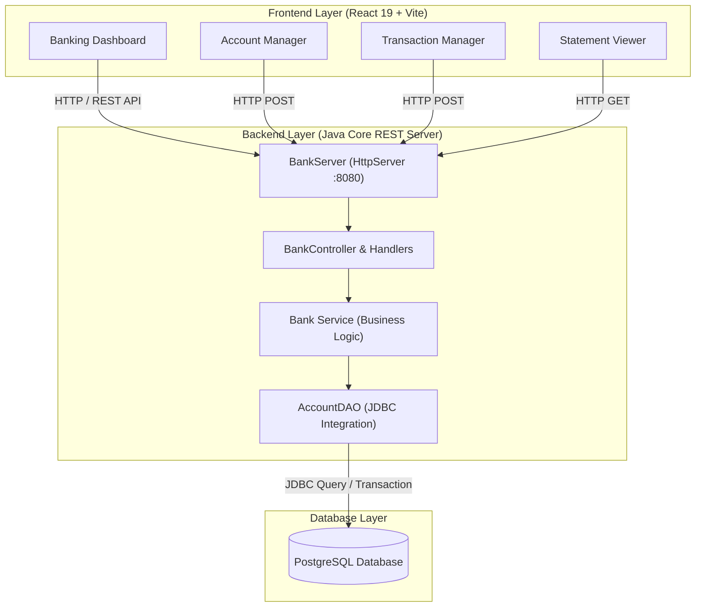

<div align="center">

  <h1>🏦 Modern Banking Management System</h1>
  <p><b>A full-stack, enterprise-grade banking application powered by Java, PostgreSQL, and React 19</b></p>

  <p>
    <a href="#-key-features">Key Features</a> •
    <a href="#-tech-stack">Tech Stack</a> •
    <a href="#-architecture">Architecture</a> •
    <a href="#-getting-started">Getting Started</a> •
    <a href="#-api-documentation">API Reference</a> •
    <a href="#-database-schema">Database</a>
  </p>

  <p>
    
    
    
    
    
  </p>

  ---
</div>

## 📌 Overview

The **Modern Banking Management System** is a robust, full-stack financial application designed for high efficiency, security, and seamless user interaction. It combines a lightweight, high-performance **Java REST API HTTP Server** backed by a **PostgreSQL** relational database with a stunning, modern **React 19 + Vite** single-page web dashboard.

Whether creating multi-tier accounts (Savings & Current), performing real-time fund deposits/withdrawals, transferring capital between accounts safely, or generating instant digital bank statements, this application provides an intuitive glassmorphic interface and reliable backend infrastructure.

---

## ✨ Key Features

| Feature | Description |
| :--- | :--- |
| **💳 Multi-Type Account Creation** | Seamlessly register **Savings** (with interest calculation) or **Current** (with overdraft protection) accounts. |
| **⚡ Instant Transactions** | Deposit funds, withdraw cash with balance validations, and perform instant intra-bank fund transfers. |
| **📄 Digital Bank Statements** | Real-time generation of transaction history, current balance breakdowns, and interest rate insights. |
| **📊 Real-time Dashboard** | Interactive dark-mode glassmorphic UI displaying global liquidity, account metrics, and transaction logs. |
| **🔐 Database Persistence** | Pure JDBC architecture connected to PostgreSQL for ACID-compliant transactional consistency. |
| **🌐 RESTful API Server** | Zero-framework core Java HTTP server delivering fast processing and built-in CORS handling. |

---

## 🛠 Tech Stack

### **Backend**
- **Language**: Java 17+
- **HTTP Server**: `com.sun.net.httpserver.HttpServer` (Core Lightweight REST Engine)
- **Database**: PostgreSQL 14+
- **Data Access**: JDBC (Java Database Connectivity) with `postgresql-42.7.13.jar`
- **Architecture**: MVC + DAO (Data Access Object) Pattern

### **Frontend**
- **Framework**: React 19 (Hooks, Functional Components)
- **Build Tool**: Vite 8
- **Styling**: Vanilla CSS (Custom Design System with CSS Variables & Glassmorphism)
- **Linter**: Oxlint

---

## 🏗 Architecture



---

## 📁 Project Structure

```
banking system/
├── 📂 lib/                       # Third-party Java libraries (PostgreSQL JDBC driver)
│   └── postgresql-42.7.13.jar
├── 📂 src/                       # Java Backend Source Code
│   ├── 📂 controller/            # REST API Handlers & BankServer engine
│   │   ├── BankController.java
│   │   └── BankServer.java
│   ├── 📂 dao/                   # Data Access Objects (SQL queries & JDBC)
│   │   └── AccountDAO.java
│   ├── 📂 exception/             # Custom domain exceptions
│   ├── 📂 model/                 # Domain Entities (Account, SavingsAccount, CurrentAccount)
│   │   ├── Account.java
│   │   ├── SavingsAccount.java
│   │   └── CurrentAccount.java
│   ├── 📂 service/               # Core Banking Business Logic
│   │   └── Bank.java
│   └── 📂 util/                  # Utility classes (Database connection manager)
│       └── DatabaseConnection.java
├── 📂 frontend/                  # React 19 Frontend Web Client
│   ├── 📂 src/
│   │   ├── App.jsx               # Main Dashboard UI Component
│   │   ├── App.css               # Glassmorphic Styling & Dark Theme
│   │   └── main.jsx              # React DOM entry point
│   ├── package.json
│   └── vite.config.js
├── 📄 .env                       # Environment Configuration (DB URL, Credentials)
├── 📄 schema.sql                 # PostgreSQL Database DDL Script
└── 📄 README.md                  # Project Documentation
```

---

## 🚀 Getting Started

Follow these step-by-step instructions to get the application running on your local machine.

### 📋 Prerequisites

Ensure you have the following software installed:
- **Java Development Kit (JDK)**: Version 17 or higher
- **Node.js**: Version 18.0 or higher
- **PostgreSQL**: Version 14 or higher
- **Git**

---

### 1️⃣ Database Setup

1. Open your terminal or PostgreSQL GUI (`psql` or `pgAdmin`).
2. Create a database named `banking_system`:
   ```sql
   CREATE DATABASE banking_system;
   ```
3. Run the schema creation script from `schema.sql`:
   ```bash
   psql -U postgres -d banking_system -f schema.sql
   ```

---

### 2️⃣ Environment Configuration

Create or edit the `.env` file in the project root directory with your PostgreSQL connection details:

```env
DB_URL=jdbc:postgresql://localhost:5432/banking_system
DB_USER=postgres
DB_PASSWORD=your_postgres_password
```

---

### 3️⃣ Running the Java Backend Server

#### **On Windows (PowerShell / Command Prompt)**

1. Compile the Java source files:
   ```powershell
   javac -cp "lib/postgresql-42.7.13.jar" -d bin src/model/*.java src/exception/*.java src/util/*.java src/dao/*.java src/service/*.java src/controller/*.java
   ```

2. Start the REST API server:
   ```powershell
   java -cp "bin;lib/postgresql-42.7.13.jar" controller.BankServer
   ```
   > 🚀 **Server output**: `[BANK] REST API Server started on http://localhost:8080`

---

### 4️⃣ Running the React Frontend

1. Open a new terminal window and navigate to the `frontend` directory:
   ```bash
   cd frontend
   ```

2. Install dependencies:
   ```bash
   npm install
   ```

3. Launch the Vite development server:
   ```bash
   npm run dev
   ```

4. Open your browser and navigate to **`http://localhost:5173`** (or the URL shown in terminal).

---

## 🔌 API Documentation

The Java backend exposes a clean RESTful API on `http://localhost:8080`.

| Endpoint | Method | Description | Request Body / Query Params |
| :--- | :--- | :--- | :--- |
| `/api/health` | `GET` | Server health check | N/A |
| `/api/accounts` | `GET` | Fetch all bank accounts | N/A |
| `/api/accounts/savings` | `POST` | Create a new Savings Account | `accNum`, `name`, `balance`, `interestRate` |
| `/api/accounts/current` | `POST` | Create a new Current Account | `accNum`, `name`, `balance`, `overdraftLimit` |
| `/api/accounts/deposit` | `POST` | Deposit funds into an account | `accNum`, `amount` |
| `/api/accounts/withdraw` | `POST` | Withdraw funds from an account | `accNum`, `amount` |
| `/api/accounts/transfer` | `POST` | Transfer funds between accounts | `fromAccNum`, `toAccNum`, `amount` |
| `/api/accounts/statement` | `GET` | Get statement for account | `?accNum=ACC1001` |

---

## 🗄 Database Schema

The database schema defined in [`schema.sql`](file:///c:/Users/Reehan/Videos/banking%20system/schema.sql) is concise and optimized:

```sql
CREATE TABLE IF NOT EXISTS accounts (
    account_number VARCHAR(50) PRIMARY KEY,
    holder_name VARCHAR(100) NOT NULL,
    balance NUMERIC(15, 2) NOT NULL,
    account_type VARCHAR(20) NOT NULL
);
```

---

## 🛡 License

This project is open-source and licensed under the **MIT License**.

---

<div align="center">
  <sub>Built with ❤️ using Java & React</sub>
</div>
